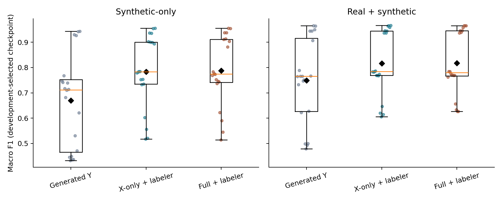
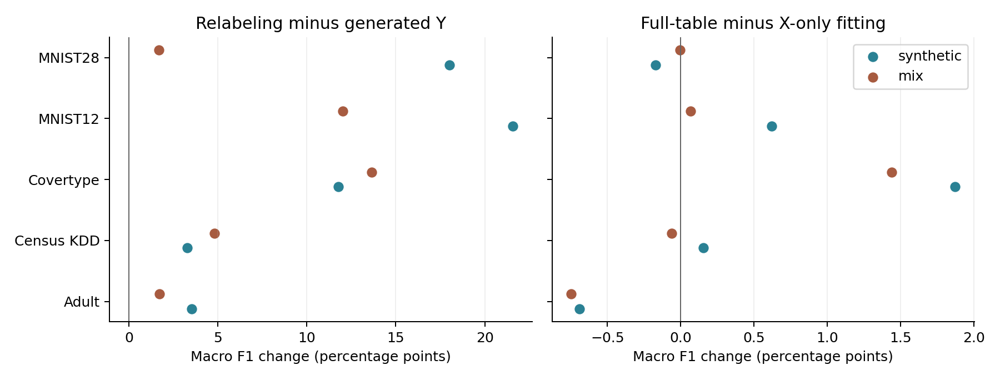
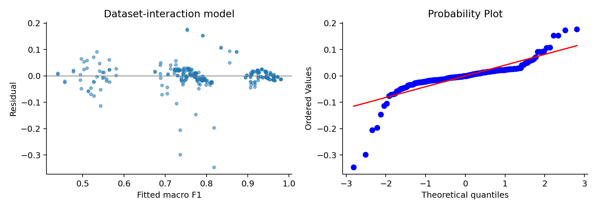

```{r setup, include=FALSE}
knitr::opts_chunk$set(echo=FALSE)
```

# 1. Terms and experimental design

**Research question:** What are the factors, and which comparisons do they define?

**Method:** Define each factor and list its levels before interpreting the models.

**Finding:** Each generator has seven conditions, evaluated with two training modes and two seeds. Real-only runs are separate reference points.

| Term | Meaning | Levels used |
| --- | --- | --- |
| dataset | Task being evaluated. | Classification: Adult, Census KDD, Covertype, MNIST12, MNIST28. Regression: News and Housing. |
| generator | Model producing synthetic rows. | CTGAN; TVAE. |
| source / has_y | Columns used to fit the generator. | full / has_y=1: (X,Y). xonly / has_y=0: X. Both generate features X. |
| labeler | Predictor trained on real training data to assign synthetic Y. | RF (random forest); XGB (XGBoost); DNN (neural network). |
| condition | One complete choice of feature source and target construction. | generated; rf_full; rf_xonly; xgb_full; xgb_xonly; dnn_full; dnn_xonly. |
| approach | How the synthetic target is obtained. | Generated Y; relabeled Y (the six RF/XGB/DNN conditions). |
| group / approach_has_y | Three groups used in the mixed model. | generated; hybrid_xonly; hybrid_full. Each hybrid group averages RF/XGB/DNN equally. |
| mode | Rows used for downstream training. | synthetic: 100,000 synthetic rows only. mix: all real training rows plus 100,000 synthetic rows. |
| seed | Experiment random-number setting. | 42; 43. The prepared split is the same for both. |
| original | Real-only reference model. | Real training rows only; outside the seven-condition ANOVA. |

**X** = predictors; **Y** = target. Generated Y exists only for a full-table generator; there is no generated-target X-only condition. The downstream evaluator is a neural model in every arm. RF/XGB are labelers, not downstream evaluators.

These are **factor levels**, not target class labels. The selected snapshot has 406 runs: 290 classification and 116 regression. Classification models use macro F1; regression metrics are kept separate.

**Macro F1** averages the F1 scores of all target classes equally, on a 0-1 scale.

# 2. Does relabeling improve downstream utility?

**Research question:** Do targets predicted from real training data outperform the generator's own targets?

**Method:** Compare the mean of all six relabeled conditions with generated Y. Use a dataset-intercept mixed model, then check the contrast using five dataset means.

**Finding:** Mean macro F1 rises from **0.7090 to 0.8010**: **+0.0920 points (+12.98% relative)**. The model finds a clear effect; evidence across datasets is weaker after adjustment.

**Average effect by training mode**

| Training mode | Generated | Relabeled | F1 change | Relative gain |
| --- | --- | --- | --- | --- |
| pooled | 0.7090 | 0.8010 | +0.0920 | 12.98% |
| synthetic | 0.6692 | 0.7855 | +0.1163 | 17.38% |
| mix | 0.7488 | 0.8166 | +0.0677 | 9.04% |

**Same pooled contrast, two scopes of inference**

| Test and question answered | 95% CI for F1 change | Adjusted p | Sig. |
| --- | --- | --- | --- |
| **Mixed model: average effect under its dataset-intercept assumptions.** | **[+0.0664, +0.1176]** | **7.47e-12** | **\*\*\*** |
| Dataset paired t-test: how variable is the effect across five tasks? | [+0.0185, +0.1656] | 0.0924 | . |

Significance: p < 0.001 = \*\*\*; p < 0.01 = \*\*; p < 0.05 = \*; p < 0.10 = .; blank otherwise. Bold rows have p < 0.05. Symbols use Holm-adjusted p over four planned contrasts.

Boxes show variation in macro F1 across tasks, seeds and generators. Black diamonds are group means.



The dataset-level raw t-test p is 0.0255; exact sign-flip p is 0.0625. The confidence intervals are unadjusted; Holm p accounts for testing four contrasts. Five positive task effects do not establish improvement on every future dataset. Relative gain = score change / generated mean; +0.0920 F1 equals +9.20 percentage points.

# 3. Does including Y in generator fitting help?

**Research question:** Among relabeled constructions, is fitting on (X,Y) better than fitting on X only?

**Method:** Match full and X-only results within dataset, seed, generator, labeler and mode; report their mean difference and dataset-level confidence interval.

**Finding:** The pooled change is **+0.00248 macro-F1 points (+0.31% relative)**. The confidence interval includes zero; there is no clear full-table advantage.

| Training | X-only | Full | F1 change | 95% paired-t CI | Adjusted p | Sig. |
| --- | --- | --- | --- | --- | --- | --- |
| pooled | 0.7998 | 0.8023 | +0.0025 | [-0.0084, +0.0134] | 0.5621 |  |
| synthetic | 0.7837 | 0.7873 | +0.0036 | [-0.0085, +0.0156] | 0.4575 |  |
| mix | 0.8159 | 0.8172 | +0.0014 | [-0.0085, +0.0113] | 0.7182 |  |

Significance: p < 0.001 = \*\*\*; p < 0.01 = \*\*; p < 0.05 = \*; p < 0.10 = .; blank otherwise. Bold rows have p < 0.05. Symbols use Holm-adjusted dataset-level p over four contrasts.

| Dataset | Relabeled - generated | Full - X-only |
| --- | --- | --- |
| Adult | +0.0262 | -0.0072 |
| Census KDD | +0.0404 | +0.0005 |
| Covertype | +0.1269 | +0.0165 |
| MNIST12 | +0.1680 | +0.0034 |
| MNIST28 | +0.0986 | -0.0009 |

Left: relabeling gains. Right: full-table versus X-only gains. Positive values favor the first construction named.



Full and X-only both generate X and replace Y with the same type of labeler. This question concerns including Y during generator fitting. A nonsignificant difference does not prove the two constructions equivalent.

# 4. Do method effects differ across datasets?

**Research question:** Can one common method effect describe all five classification tasks?

**Method:** Fit the original-project blocked model, then add dataset x condition. These ordinary linear models are exploratory because scores within a dataset are correlated.

**Finding:** The dataset x condition interaction is strong in the exploratory model (p = **3.76e-12**). Method benefits vary by task, so one pooled effect is incomplete.

**Blocked model:** macro F1 ~ dataset + generator * condition * mode.

| Term | SS | df | F | Nominal p | Sig. |
| --- | --- | --- | --- | --- | --- |
| **dataset** | **4.5354** | **4** | **341.62** | **1.38e-99** | **\*\*\*** |
| **generator** | **0.0204** | **1** | **6.14** | **0.0138** | **\*** |
| **condition** | **0.3840** | **6** | **19.28** | **1.97e-18** | **\*\*\*** |
| **mode** | **0.1009** | **1** | **30.41** | **8.78e-08** | **\*\*\*** |
| **generator x condition** | **0.1063** | **6** | **5.34** | **3.35e-05** | **\*\*\*** |
| generator x mode | 0.0043 | 1 | 1.29 | 0.2563 |  |
| condition x mode | 0.0212 | 6 | 1.07 | 0.3841 |  |
| generator x condition x mode | 0.0188 | 6 | 0.94 | 0.4642 |  |
| Residual | 0.8231 | 248 |  |  |  |

**Dataset-interaction model:** macro F1 ~ dataset * condition + generator + mode.

| Term | SS | df | F | Nominal p | Sig. |
| --- | --- | --- | --- | --- | --- |
| **dataset** | **4.5354** | **4** | **428.58** | **8.82e-109** | **\*\*\*** |
| **condition** | **0.3840** | **6** | **24.19** | **2.10e-22** | **\*\*\*** |
| **generator** | **0.0204** | **1** | **7.71** | **0.0059** | **\*\*** |
| **mode** | **0.1009** | **1** | **38.15** | **2.74e-09** | **\*\*\*** |
| **dataset x condition** | **0.3308** | **24** | **5.21** | **3.76e-12** | **\*\*\*** |
| Residual | 0.6429 | 243 |  |  |  |

Significance: p < 0.001 = \*\*\*; p < 0.01 = \*\*; p < 0.05 = \*; p < 0.10 = .; blank otherwise. Bold rows have p < 0.05. Symbols use nominal p; these exploratory tables are not adjusted.

**How to read the terms:** generator asks whether CTGAN and TVAE differ on average. condition asks whether the seven constructions differ. mode asks whether synthetic-only and mix differ. dataset x condition asks whether the construction effect changes with the dataset. Other x terms ask the same dependence question for their named factors.

In the formulas, **C(term)** means categorical. **a * b** includes a, b and their interaction; **a:b** is the interaction alone. **SS** is variation assigned to a term; **df** counts its independent comparisons; **F** compares term variation with residual variation. **Residual** is the variation the model leaves unexplained.

# 5. Which generator and labeler combinations benefit?

**Research question:** Which relabeled construction has the largest observed improvement over its own generator baseline?

**Method:** Compare each generator/labeler/source with its matched generated-Y baseline, averaging seeds and giving each of the five tasks equal weight.

**Finding:** CTGAN has larger observed gains than TVAE; DNN gives the largest observed gain for both generators. Individual combinations remain exploratory: none passes Holm adjustment across 24 tests.

**Synthetic-only**

| Generator | Labeler | Source | F1 change | Relative gain | Adjusted p | Sig. |
| --- | --- | --- | --- | --- | --- | --- |
| CTGAN | RF | full | +0.1774 | 30.1% | 1.0000 |  |
| CTGAN | RF | xonly | +0.1778 | 30.2% | 1.0000 |  |
| CTGAN | XGB | full | +0.1860 | 31.6% | 1.0000 |  |
| CTGAN | XGB | xonly | +0.1772 | 30.1% | 1.0000 |  |
| CTGAN | DNN | full | +0.2287 | 38.8% | 1.0000 |  |
| CTGAN | DNN | xonly | +0.2239 | 38.0% | 1.0000 |  |
| TVAE | RF | full | +0.0219 | 2.9% | 1.0000 |  |
| TVAE | RF | xonly | +0.0184 | 2.5% | 1.0000 |  |
| TVAE | XGB | full | +0.0275 | 3.7% | 0.3251 |  |
| TVAE | XGB | xonly | +0.0254 | 3.4% | 0.6707 |  |
| TVAE | DNN | full | +0.0672 | 9.0% | 1.0000 |  |
| TVAE | DNN | xonly | +0.0645 | 8.6% | 1.0000 |  |

**Real + synthetic**

| Generator | Labeler | Source | F1 change | Relative gain | Adjusted p | Sig. |
| --- | --- | --- | --- | --- | --- | --- |
| CTGAN | RF | full | +0.0793 | 11.1% | 1.0000 |  |
| CTGAN | RF | xonly | +0.0857 | 12.0% | 1.0000 |  |
| CTGAN | XGB | full | +0.0928 | 13.0% | 1.0000 |  |
| CTGAN | XGB | xonly | +0.0902 | 12.6% | 1.0000 |  |
| CTGAN | DNN | full | +0.1277 | 17.8% | 1.0000 |  |
| CTGAN | DNN | xonly | +0.1243 | 17.3% | 1.0000 |  |
| TVAE | RF | full | +0.0189 | 2.4% | 1.0000 |  |
| TVAE | RF | xonly | +0.0160 | 2.1% | 1.0000 |  |
| TVAE | XGB | full | +0.0325 | 4.2% | 1.0000 |  |
| TVAE | XGB | xonly | +0.0255 | 3.3% | 1.0000 |  |
| TVAE | DNN | full | +0.0594 | 7.6% | 1.0000 |  |
| TVAE | DNN | xonly | +0.0605 | 7.7% | 1.0000 |  |

Significance: p < 0.001 = \*\*\*; p < 0.01 = \*\*; p < 0.05 = \*; p < 0.10 = .; blank otherwise. Bold rows have p < 0.05. Symbols use Holm-adjusted dataset-level p over 24 combinations.

These are gains over generated Y, not a direct significance test of DNN versus RF/XGB. No best seed or test epoch is selected. Per-combination means, confidence intervals and raw p-values remain in labeler_effects.csv.

# 6. Do the conclusions extend to regression?

**Research question:** How do relabeled tables compare with generated-target tables for News and Housing?

**Method:** Report separate means for R2, D2 absolute error and saved NMAE. Average seeds and generators equally, and average RF/XGB/DNN within each hybrid group.

**Finding:** Housing relabeling improves all three metrics over generated Y. News improves R2 slightly, while its absolute-error metrics worsen slightly. The two regression tasks are descriptive comparisons.

| Metric | Meaning | Better direction |
| --- | --- | --- |
| R2 | Squared-error reduction against a constant test-mean baseline. | Higher |
| D2 absolute error | 1 - MAE / MAE of the constant test-median baseline. | Higher |
| NMAE | MAE / standard deviation of real test targets (ddof=0). | Lower |

| Dataset / training | Construction | R2 | D2 | NMAE |
| --- | --- | --- | --- | --- |
| News / synthetic | Real only | -0.0290 | -0.0445 | 0.2686 |
| News / synthetic | Generated Y | -0.0235 | 0.0099 | 0.2546 |
| News / synthetic | Full hybrid | -0.0004 | -0.0060 | 0.2587 |
| News / synthetic | X-only hybrid | 0.0027 | -0.0098 | 0.2597 |
| News / mix | Real only | -0.0290 | -0.0445 | 0.2686 |
| News / mix | Generated Y | -0.0196 | 0.0300 | 0.2494 |
| News / mix | Full hybrid | -0.0008 | 0.0104 | 0.2544 |
| News / mix | X-only hybrid | 0.0002 | 0.0079 | 0.2551 |
| Housing / synthetic | Real only | 0.5125 | 0.2822 | 0.5507 |
| Housing / synthetic | Generated Y | 0.6730 | 0.4595 | 0.4146 |
| Housing / synthetic | Full hybrid | 0.7930 | 0.6061 | 0.3022 |
| Housing / synthetic | X-only hybrid | 0.7946 | 0.6025 | 0.3049 |
| Housing / mix | Real only | 0.5125 | 0.2822 | 0.5507 |
| Housing / mix | Generated Y | 0.6676 | 0.4607 | 0.4137 |
| Housing / mix | Full hybrid | 0.7872 | 0.6022 | 0.3052 |
| Housing / mix | X-only hybrid | 0.7905 | 0.5956 | 0.3103 |

R2 and D2 can be negative, so relative percentage changes in those scores are omitted. Saved test normalization and D2 sidecars are used directly. There are no regression ANOVA significance stars: two tasks do not support the same across-dataset inference as the five-task classification analysis.

# Appendix A. Why include a repeated-measures ANOVA?

**Research question:** Are factor effects detectable relative to seed-to-seed variation on these fixed datasets?

**Method:** Treat dataset as fixed and dataset/seed as the repeat unit. Compare all generator/condition/mode scores within each unit; partition condition into approach, labeler and has_y.

**Finding:** Relabeling is significant within this fixed-task model (adjusted p = **0.0043**); full versus X-only is not. This is a supporting check, not another test of generalization to new tasks.

| Effect | F | Adjusted df | GG p | Holm p | Sig. |
| --- | --- | --- | --- | --- | --- |
| generator | 18.02 | 1.00, 5.00 | 0.0081 | 0.2103 |  |
| **approach** | **114.52** | **1.00, 5.00** | **0.0001** | **0.0043** | **\*\*** |
| **labeler** | **691.21** | **1.19, 5.94** | **1.75e-07** | **6.48e-06** | **\*\*\*** |
| has_y | 4.12 | 1.00, 5.00 | 0.0981 | 1.0000 |  |
| **mode** | **452.26** | **1.00, 5.00** | **4.26e-06** | **0.0002** | **\*\*\*** |
| dataset x approach | 9.49 | 4.00, 5.00 | 0.0148 | 0.3408 |  |
| **dataset x labeler** | **426.99** | **4.76, 5.94** | **1.69e-07** | **6.44e-06** | **\*\*\*** |
| dataset x has_y | 10.34 | 4.00, 5.00 | 0.0123 | 0.2962 |  |
| **approach x mode** | **53.33** | **1.00, 5.00** | **0.0008** | **0.0249** | **\*** |
| generator x approach | 37.60 | 1.00, 5.00 | 0.0017 | 0.0502 | . |

Significance: p < 0.001 = \*\*\*; p < 0.01 = \*\*; p < 0.05 = \*; p < 0.10 = .; blank otherwise. Bold rows have p < 0.05. Symbols use Holm p over all 39 repeated-measures terms.

**GG** (Greenhouse-Geisser) adjusts for unequal covariance among repeated comparisons. Adjusted df lists numerator and denominator degrees of freedom. **approach** compares generated Y with the six hybrids; **labeler** and **has_y** apply within hybrids only.

| Analysis | What it contributes | Location |
| --- | --- | --- |
| Blocked / interaction models | Show which patterns vary with factors and datasets. Their ordinary p-values are exploratory. | Section 4 |
| Mixed model | Estimates average construction effects with a dataset random intercept; its covariance assumptions matter. | Section 2 |
| Dataset-level contrasts | Use five task means to assess how effects vary across tasks. | Sections 2-3 |
| Repeated-measures ANOVA | Tests fixed-task effects against seed variation. It does not create more independent datasets. | This appendix |

There are ten dataset/seed units and five residual seed degrees of freedom. Both seeds share the holdout, so these tests do not measure test-sample uncertainty. The full 39-term table and partial eta-squared values are retained in repeated_anova.csv.

# Appendix B. Why keep the model diagnostics?

**Research question:** Do the original-project models adequately describe the score patterns?

**Method:** Compare full-interaction, blocked and dataset-interaction fits; inspect residual-versus-fitted and normal Q-Q plots.

**Finding:** The full model fits closely, but simpler-model residuals are structured and nonnormal. Their nominal ANOVA p-values are insufficient on their own.

| Model | What it allows | R2 | Adjusted R2 | Residual df |
| --- | --- | --- | --- | --- |
| Full interaction | All dataset/generator/condition/mode interactions. | 0.9890 | 0.9780 | 140 |
| Blocked | Dataset starting scores; generator/condition/mode interactions. | 0.8631 | 0.8460 | 248 |
| Dataset interaction | Dataset-specific condition effects; generator and mode main effects. | 0.8931 | 0.8773 | 243 |

Dataset-interaction model residuals: pattern in the left plot and departure from normality in the right plot.



Model 3 Shapiro p = 3.50e-21. Macro F1 stays on its original 0-1 scale; no transformation was chosen to improve significance. Model summaries and the full-interaction ANOVA remain in the package.

**Mixed-model specification:** macro F1 ~ group * generator * mode + (1 | dataset), fitted to 120 group means. REML estimates the variance components; Wald intervals use a normal approximation. The fit converged. A dataset random intercept allows different starting scores, but no dataset-specific treatment slopes. The dataset-level contrast checks that limitation.

# Appendix C. Sources, exclusions and reproducibility

**Research question:** Are the report values traceable to completed runs with the intended settings?

**Method:** Use the verified frozen records, completed-record aggregate and source-linked D2 sidecars. Preserve all statistical values while revising the report presentation.

**Finding:** All 406 selected runs and 116 D2 sidecars verified. This revision changes explanations, ordering and table styling; it does not rerun experiments or statistical models.

| Dataset | Source namespace | Runs |
| --- | --- | --- |
| Adult | corrected_v2 | 58 / 58 |
| Covertype | corrected_v2 | 58 / 58 |
| Census KDD | census_kdd_weighted_macro_f1_20261005 | 58 / 58 |
| MNIST12 | mnist_head_fixed_20261009 | 58 / 58 |
| MNIST28 | mnist_head_fixed_20261009 | 58 / 58 |
| News | news_log_v1 | 58 / 58 |
| Housing | housing_no_faker_20261009 | 58 / 58 |

**Source snapshot:** October 10, 2026, 1:08:42 a.m. Chicago. D2 was added from the verified 1:10 a.m. derived-metric update. These are the same frozen results used in the earlier report.

**Scope:** CTGAN/TVAE and RF/XGB/DNN; seeds 42/43; synthetic-only/mix. Credit, Intrusion, NB/PCA-GMM, exploratory dropout trials and simulated data are excluded. Completion here does not establish completion of the broader matrix.

**Checks and caveats:** models use saved development-selected checkpoints, not test-epoch maxima. Generator budgets remain 500 epochs / batch 500 / 100,000 rows. Splits are shared across seeds. MNIST uses the repaired output heads; its retained MNIST12 TVAE tables still carry the documented holdout-feature collision caveat.

| File | Purpose |
| --- | --- |
| real_data_328_analysis.Rmd | Editable report and optional equivalent R model specification. |
| planned_contrasts.csv / mixed_contrasts.csv | Dataset-level and mixed-model effects, confidence intervals and p-values. |
| labeler_effects.csv / repeated_anova.csv | All method contrasts and repeated-measures terms. |
| scores.csv / source_snapshot.json | Saved outcomes and source-record hashes. |
| regression_* / d2_snapshot.zip | Regression scores/effects and verified D2 sidecars. |

Numerical fits ran remotely in Python. The optional R refit code has not been executed; lmerTest degrees of freedom can differ from the reported normal-Wald intervals.

## Optional equivalent R refit specification

**Research question:** Can the fitted models be reproduced in R?

**Method:** Use the code below on the supplied score tables. It is disabled during
rendering of this frozen report.

**Finding:** The delivered fits were executed remotely in Python; this optional
R refit has not been run. `lmerTest` degrees of freedom may differ from the reported
normal-Wald intervals.

```{r optional-refit-in-R, eval=FALSE, echo=TRUE}
library(lme4)
library(lmerTest)
library(emmeans)
library(car)
d <- read.csv("classification_scores.csv")
for (v in c("dataset", "generator", "condition", "mode")) d[[v]] <- factor(d[[v]])
model_full_interactions <- lm(score ~ dataset * generator * condition * mode, data=d)
model_block <- lm(score ~ dataset + generator * condition * mode, data=d)
model_dataset_interaction <- lm(score ~ dataset * condition + generator + mode, data=d)
car::Anova(model_block, type=2)
car::Anova(model_dataset_interaction, type=2)
g <- read.csv("group_scores.csv")
g$group <- factor(g$group, levels=c("generated", "hybrid_xonly", "hybrid_full"))
fit <- lmer(score ~ group * generator * mode + (1 | dataset), data=g, REML=TRUE)
emm <- emmeans(fit, ~ group, weights="equal")
contrast(emm, method=list(
 newApproach_vs_oldApproach=c(-1,0.5,0.5), hasY_vs_noY=c(0,-1,1),
 full_vs_generated=c(-1,0,1), xonly_vs_generated=c(-1,1,0)), adjust="holm")
e <- read.csv("dataset_effects.csv")
for (name in unique(e$contrast)) {
 print(t.test(subset(e, mode == "pooled" & contrast == name)$difference, mu=0))
}
```
